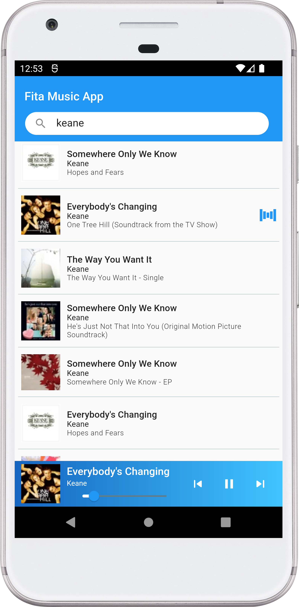
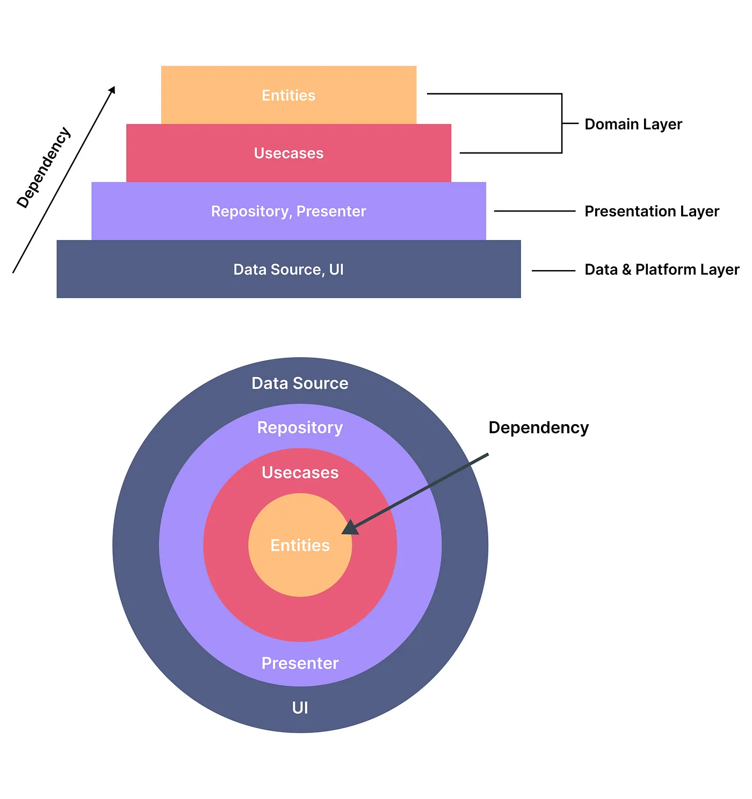

# musicplayer_fita

A music app use Apple iTunes API.

### Features
1. Search music by artist
2. Play, pause, next & prev a song
3. Search other song, while music player still running

### Support Devices
- Pixel XL (emulator) : Android 12

### List of libraries/dependencies

- [Flutter BLOC](https://bloclibrary.dev) : state management
- [http](https://pub.dev/packages/http) : handle http request
- [dartz](https://pub.dev/packages/dartz) : functional programing for handle error
- [equatable](https://pub.dev/packages/equatable) : Being able to compare objects in Dart often involves having to override the == operator as well as hashCode
- [get_it](https://pub.dev/packages/get_it) : Service locator (DI)
- [audioplayer](https://pub.dev/packages/audioplayers) : A Flutter plugin to play audio files
- [spinkit](https://pub.dev/packages/flutter_spinkit) : A collection of loading indicators animated with flutter

### Intro to deploy in local env.
1. clone the repo: git clone xxx
2. Run "flutter pub get"
3. connect device, check with "adb devices"
4. Run "main.dart"

### Design Pattern

- [Clean architecture](https://blog.cleancoder.com/uncle-bob/2012/08/13/the-clean-architecture.html) : is the blueprint for a modular system, which strictly follows the design principle called separation of concerns.
- Project Structure :
  - Layer Domain : lapisan paling dalam/tinggi. Dimana merupakan business-logic seperti entities dan usecase.
  - layer Presentation : lapisan tengah yang menjembatani antara Data dan Domain. Layer ini juga terdapat state management juga UI(pages) dari aplikasi.
  - layer Data : lapisan paling luar sebagai sumber data, dimana terdiri dari datasource, data model dan interface repository.
  - other(utils) : menyimpan resource lain seperti styles, fonts, image, dll.

### Reference
- https://medium.com/ruangguru/an-introduction-to-flutter-clean-architecture-ae00154001b0
- https://aditya-rohman.medium.com/mengembangkan-aplikasi-flutter-dengan-proses-test-driven-development-tdd-dan-mengadopsi-clean-29d29bb0702b
